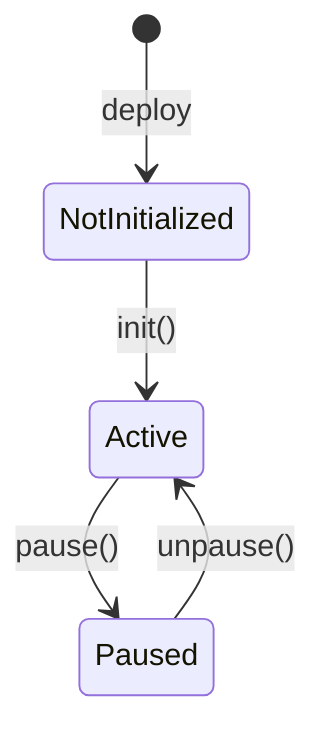
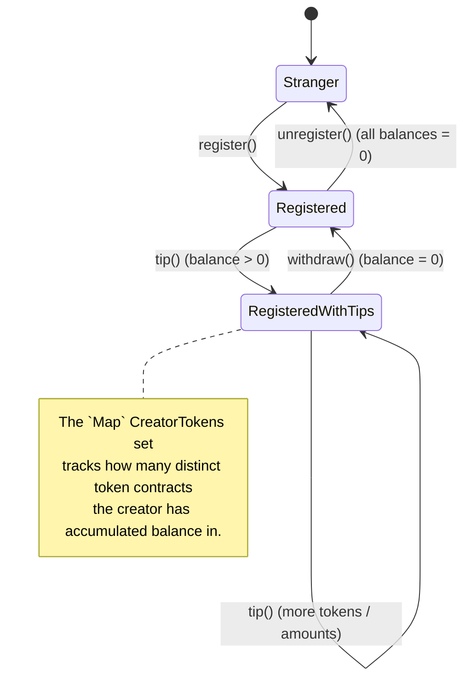
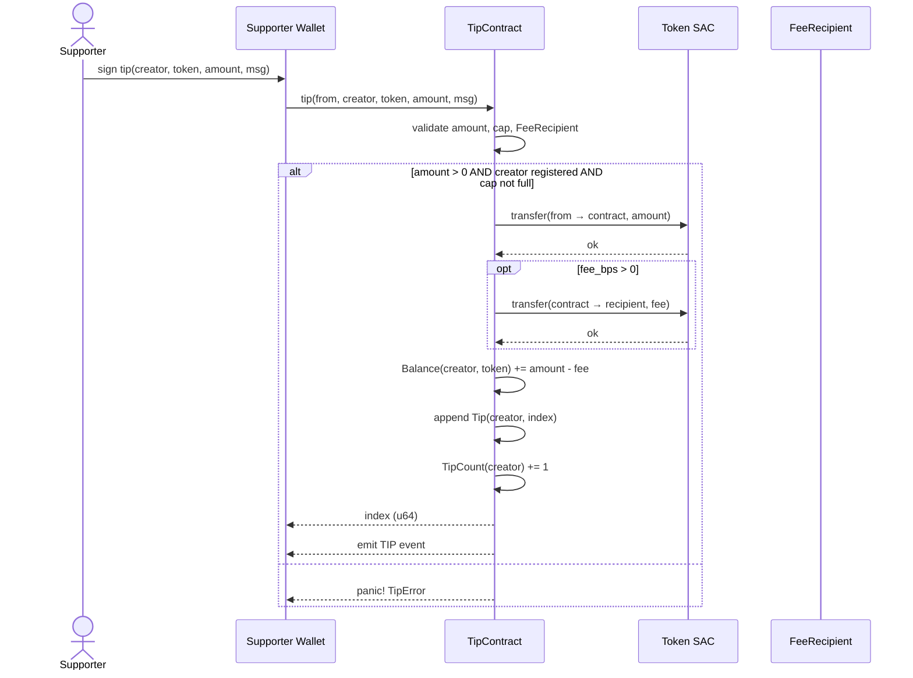

# StellarTip Architecture

> **Audience:** auditors, integrators, and operators reasoning about storage
> layout, state transitions, and the safety invariants that hold across all
> code paths.
>
> **Companion documents:**
> - [`docs/API_REFERENCE.md`](API_REFERENCE.md) — public method surface.
> - [`docs/ADMIN_RUNBOOK.md`](ADMIN_RUNBOOK.md) — operator response procedures.
> - [`docs/tutorial.md`](tutorial.md) — end-to-end testnet walkthrough.

---

## 1. Lifecycle at a Glance

The contract evolves along **two independent lifecycles**:

1. **Contract lifecycle** — governed by `init()` / `pause()` / `unpause()`.
2. **Per-address lifecycle** — governed by `register()` / `tip()` /
   `withdraw()` / `unregister()`.

These are decoupled: a paused contract still allows admin setters, and a
non-existent creator cannot receive tips regardless of pause state.

### 1.1 Contract lifecycle



There is no `selfdestruct` opcode available to Soroban contracts, so the
contract lifecycle is terminal: recovery from pause is `unpause()`,
recovery from a fundamentally broken contract is a redeploy.

### 1.2 Per-address lifecycle

Every address passes through this state machine independently.



The "registered but never tipped" state is collapsed to `Registered`; the
`RegisteredWithTips` distinction matters only because `unregister()` and
`withdraw()` consult the `CreatorTokens` set to ensure every per-token
balance is drained before the profile is removed.

---

## 2. `tip()` Sequence



The owner of `creator`'s internal balance only learns the balance changed via
the `TIP` event and a subsequent `get_balance()` poll — they do not need to
co-sign.

---

## 3. Storage Key Table

Defined in `src/lib.rs` as the `DataKey` `#[contracttype]` enum. There are
two storage domains:

- **Instance storage** — small, frequently-read config and indexes
  (`Admin`, `Paused`, `FeeBps`, `FeeRecipient`, `MaxCreators`,
  `MaxTipsPerCreator`, `MinTipAmount`, `CreatorCount`, `Profile`,
  `UsernameToAddress`).
- **Persistent storage** — large, long-lived creator state and history.
  Persistent entries have TTL extended on every read/write
  (`extend_persistent_ttl(env, &key)`).

| `DataKey` variant                          | Domain     | Typed value           | Owner / scope                          | Read by                                       | Written by                                                       |
|--------------------------------------------|------------|-----------------------|----------------------------------------|-----------------------------------------------|------------------------------------------------------------------|
| `Admin`                                    | Instance   | `Address`             | Singleton                              | every admin setter / `check_initialized_and_not_paused` | `init()`, `set_admin()`                                          |
| `Paused`                                   | Instance   | `bool`                | Singleton                              | `check_initialized_and_not_paused`            | `init()`, `pause()`, `unpause()`                                 |
| `FeeBps`                                   | Instance   | `u32` (0–10 000)      | Singleton                              | `tip()`                                       | `init()`, `set_fee_percentage()`                                 |
| `FeeRecipient`                             | Instance   | `Address`             | Singleton                              | `tip()`                                       | `init()`, `set_fee_recipient()`                                  |
| `MaxCreators`                              | Instance   | `u32` (0=unlimited)   | Singleton                              | `register()`                                  | `init()`, `set_max_creators()`                                   |
| `MaxTipsPerCreator`                        | Instance   | `u32` (0=unlimited)   | Singleton                              | `tip()`                                       | `init()`, `set_max_tips_per_creator()`                           |
| `MinTipAmount`                             | Instance   | `i128` (0=no minimum) | Singleton                              | `tip()`                                       | `init()`, `set_min_tip_amount()`                                 |
| `CreatorCount`                             | Instance   | `u32`                 | Singleton                              | `register()`                                  | `register()` (+1), `unregister()` (−1)                           |
| `Profile(address)`                         | Instance   | `CreatorProfile`      | Per-creator                            | view fns + auth                              | `register()`, `update_profile()` (mutates in place)              |
| `UsernameToAddress(symbol)`                | Instance   | `Address`             | Per-username                           | view fns                                      | `register()` (set), `unregister()` (remove)                     |
| `Balance(creator, token)`                  | Persistent | `i128`                | Per (creator, token) pair              | `withdraw()`, view fns                        | `tip()` (credit), `withdraw()` (debit / remove when zero)        |
| `TipCount(creator)`                        | Persistent | `u64`                 | Per creator                            | `tip()` (cap check + index), `unregister()`   | `register()` (init `0`), `tip()` (+1), `unregister()` (remove)   |
| `Tip(creator, index)`                      | Persistent | `Tip`                 | Per tip record                         | `get_tip()`, `get_tips()`                     | `tip()`                                                          |
| `CreatorTokens(creator)`                   | Persistent | `Map<Address, ()>`    | Per creator; O(log n) set              | `tip()`, `withdraw()`, `unregister()`         | `tip()` (insert on first tip in token), `withdraw()` (remove on zero), `unregister()` (remove all) |

### 3.1 TTL policy

Persistent entries use a 15-day threshold / 30-day extension target
(`TTL_THRESHOLD = 17_280 * 15`, `TTL_EXTEND = 17_280 * 30` ledgers):

```text
env.storage().persistent().extend_ttl(key, TTL_THRESHOLD, TTL_EXTEND);
```

Persistent TTL is extended on every **write** of these keys; view
functions (`get_tip_count`, `get_balance`, `get_tip`, `get_tips`,
`get_all_tokens`) deliberately do **not** extend TTL to keep poll costs
predictable. Concretely, `extend_persistent_ttl(&env, &key)` is invoked by:

- `TipCount(creator)` — written by `register()` (init `0`) and `tip()`
  (increment).
- `Balance(creator, token)` — written on each `tip()` credit and on
  `withdraw()` while the balance remains > 0.
- `Tip(creator, idx)` — written when a tip is recorded.
- `CreatorTokens(creator)` — written whenever the set is mutated.

`unregister()` **removes** the `TipCount(caller)` key rather than
extending it, so the persistent slot is freed once all balances are
drained.

Instance TTL is centrally extended by `extend_instance_ttl(env)` at the top
of `check_initialized_and_not_paused`, which is called by every public
state-changing method. Read-only views do **not** extend instance TTL to
avoid gas amplification on repeat polling.

---

## 4. Cross-cutting Invariants

The following properties hold for every code path in `src/lib.rs`. They are
the audit baseline; any PR that weakens one of these needs to call it out
explicitly in the change description.

1. **Forward-only capacity caps.** Lowering `MaxCreators` or
   `MaxTipsPerCreator` blocks new activity past the cap but **never
   retroactively** evicts existing creators or tip history. Recovery from a
   "cap reached" condition is achieved by raising the cap or
   `unregister()`-ing underused creators.
2. **Conservation of funds on `unregister()`.** `unregister()` iterates the
   `CreatorTokens(creator)` map; if any per-token `Balance(creator, token)`
   is non-zero, the call aborts with `#13 BalanceNotEmpty`. Zero-balance
   records are then pruned atomically. There is no path that destroys
   funds or leaves stranded credits.
3. **Fee math precision.** `tip()` computes
   `fee = (amount * fee_bps) / 10_000` and then `creator_amount = amount - fee`,
   giving the recipient the **floor** of the sharp fee. Integer truncation
   is acceptable: a single tip cannot round to a value larger than
   `MAX_FEE_BPS * 1`.
4. **Self-reference guards.** Neither `set_fee_recipient()` nor `set_admin()`
   accepts the contract's own address; `init()` additionally rejects the
   Stellar all-zero address for `fee_recipient`. This blocks fee-routing
   loops and deadlocked admin handovers.
5. **No `panic!` outside typed errors.** Every failure path uses
   `panic_with_error!(env, TipError::Variant)`; there are no bare
   `.unwrap()` calls on storage reads. `L-1` from `docs/static-analysis-findings.md`
   captured this as a low-severity advisory, and the contract follows the
   guidance in production.
6. **Fail-fast on missing preconditions.** All state changes call
   `check_initialized_and_not_paused(&env)` first, and `tip()` further
   re-validates the fee-recipient invariant under `unwrap_or_else` to
   surface `#15 FeeRecipientNotSet` rather than a generic panic.7. **`TipCount` is the canonical history length.** `get_tip_count()` reads
    the persistent `TipCount` directly; `tip()` uses the same value as the
    next free index. The `index >= max_tips` cap check uses the
    pre-increment value, so the contract never rounds a tip index below
    `0` even under degenerate `MaxTipsPerCreator` configurations.
8. **Reservation of `#7 NoTips`.** `TipError::NoTips` is defined but not
   raised by any current code path; it is reserved for a future "no tip
   history" surface. Renumbering this code is forbidden by ABI stability.
9. **Token set is `Map<Address, ()>`, not `Vec<Address>`.** Membership and
   removal are O(log n) rather than O(n). This avoids a
   linear-scan-based DoS surface on `unregister()` for popular creators.
10. **Pause does not lock admins out.** `pause()` blocks
    `register`/`tip`/`withdraw` (and view-fn access via
    `check_initialized_and_not_paused`), but admin setters still need to
    call that helper and therefore still execute while paused — by design,
    so admin recovery can proceed during an active incident.

---

## 5. Event Surface

See the [events table in `docs/API_REFERENCE.md`](API_REFERENCE.md#events)
for the canonical list including topics and payloads. Indexers should treat
every `TipEvent::INIT` event as the start of a contract life and trust
`get_contract_version()` thereafter.

---

## 6. Error Numbering

`TipError::Variant` numeric values are part of the ABI on Stellar Soroban —
they're emitted as `#N` strings via `panic_with_error!`. See the
[errors table in `docs/API_REFERENCE.md`](API_REFERENCE.md#errors) for the
current numbering. **Do not reorder existing codes.**

---

## 7. Future-proofing Notes

- `init()` is single-shot. There is no `reinit()` or upgrade hook; changes
  are deployed by redeploying the WASM and migrating state off-chain.
- `get_tips` paginates but does **not** enforce a server-side `limit`
  ceiling (`100` ceiling, per `M-2` recommendation) — clients should
  constrain `limit` themselves
  (advisory from `M-2` in `docs/static-analysis-findings.md`).
